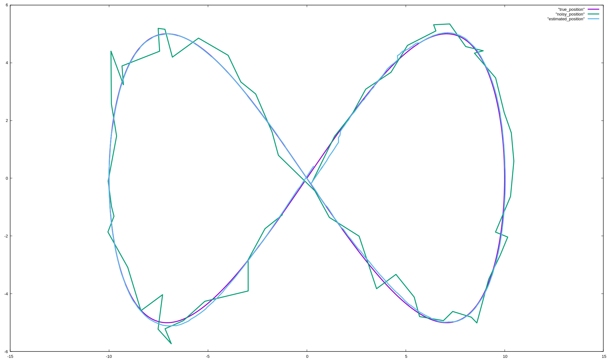

# A 2D Car Extended Kalman Filter

Refer to the [Simple 1D](simple_1d.md) tutorial for a basic introduction to the EKF library. This tutorial covers more complex topics like:
* nonlinear process and measurement models,
* Mahalanobis gating for outlier rejection,
* angle-aware residuals for yaw,
* stateful measurement models


The filter estimates a 2D car state:

$$\vec{s} = (x,\ y,\ \gamma,\ v,\ w,\ a)^T,$$

where:

- $x, y$ are position,
- $\gamma$ is heading angle,
- $v$ is linear speed,
- $w$ is angular speed,
- $a$ is linear acceleration.

Three sensor types are fused:

1. linear and angular speed sensor $(v, w)$,
2. pose sensor $(x, y, \gamma)$,
3. marker-distance sensor (distance to a known 2D marker position).

## Including the library

```cpp headers
#include <random>
#include <iostream>
#include <fstream>
#include <cmath>

#include "EKF.hpp"

using namespace ekf;
using namespace Eigen;
```

## Defining the 2D process model

`Car2DModel` derives from `ProcessModelBase<double, 6>` and implements
a  nonlinear motion prediction and Jacobian $F$ for covariance propagation.

One of the key notable differences here is that the process model `Car2DModel` is
stateful and implements a *nonstatic* `predict(...)` method.
The `Car2DModel` class stores the process noise covariance `Q` as a member variable,
which can be set at runtime from configuration parameters.

Given the current car state with pose $(x, y, \gamma)$, linear velocity $v$, angular velocity $w$ and linear acceleration $a$, the model predicts the next state after a time step $dt$ according to the following assumptions.
The car travels the distance $l = vdt + \frac{1}{2}adt^2$ in the average direction of the yaw angle $\gamma + 0.5 w dt$, while the yaw angle changes from $\gamma$ to $\gamma + w dt$.
This advances $(x, y)$ to a new position
$\big(x + l \cos(\gamma + \frac{1}{2} w dt), \\; y + l \sin(\gamma + \frac{1}{2} w dt)\big)$.

Notice that during the update $\gamma$ (yaw angle) is wrapped with `normalizeAngle(...)`
so it stays in the $[-\pi, \pi]$ range.

```cpp process_model
// The Car 2D model is a simple kinematic model with 2d position, yaw angle,
// linear and angular velocity, and linear acceleration.
// The state vector is defined as [x, y, yaw, v, w, a].
class Car2DModel : public ProcessModelBase<double, 6> {
public:
    // process noise covariance
    StateCovariance Q; // this must be defined somewhere!!!
    // return the predicted state, the Jacobian, and the process noise covariance
    std::tuple<State, StateJacobian, StateCovariance>
    predict(const State& state, double dt) {
        // car position
        double x = state[0];
        double y = state[1];
        // car yaw angle
        double yaw = state[2];
        // car linear velocity
        double v = state[3];
        // car angular velocity
        double w = state[4];
        // car linear acceleration
        double a = state[5];
        // predicted traveled distance
        double l = v*dt + 0.5*a*dt*dt;
        // precompute the cos and sin of the yaw angle for the prediction step
        // note that we use the average yaw angle to improve accuracy
        double cos_ = cos(yaw + 0.5*w*dt);
        double sin_ = sin(yaw + 0.5*w*dt);
        State state_pred(
            x + l*cos_, // predict x position
            y + l*sin_, // predict y position
            // note the normalizeAngle to keep the yaw angle in the range [-pi, pi]
            normalizeAngle(yaw + w*dt), // predict yaw angle
            v + a*dt, // predict linear velocity
            w, // predict angular velocity
            a // predict linear acceleration
        );
        StateJacobian F;
        //   x  y      yaw        v              w                a
        F << 1, 0, -l*sin_, cos_*dt, -0.5*l*sin_*dt, 0.5*cos_*dt*dt, // x
             0, 1,  l*cos_, sin_*dt,  0.5*l*cos_*dt, 0.5*sin_*dt*dt, // y
             0, 0,       1,       0,             dt,              0, // yaw
             0, 0,       0,       1,             0,              dt, // v
             0, 0,       0,       0,             1,               0, // w
             0, 0,       0,       0,             0,               1; // a
        return {state_pred, F, Q*dt};
    }
};
```

## Measurement model 1: speed (`v`, `w`)

`SpeedMeasurementModel` is linear and static:

```cpp speed_measurement
class SpeedMeasurementModel : public MeasurementModelBase<double, 6, 2> {
public:
    static std::pair<Vector<double, 2>, Matrix<double, 2, 6>>
    measure(const Vector<double, 6>& state) {
        Matrix<double, 2, 6> H;
        H << 0, 0, 0, 1, 0, 0, // v
             0, 0, 0, 0, 1, 0; // w
        // In this linear example, the Jacobian equals H and the predicted measurement is H*state
        return {H*state, H};
    }
    // Accept measurements with 95% probability,
    // i.e. reject measurements that are too far away from the predicted measurement.
    static constexpr Real gatingProbability = 0.95;
};
```
Notice redefining the `gatingProbability` constant in the measurement model to
change the outlier rejection threshold for this sensor type.
This is configured per measurement model, so different sensors can have different gating behavior.
- `0.95` means keep measurements that are statistically consistent at 95% confidence.
- Larger values are more permissive; smaller values reject more aggressive outliers.

## Measurement model 2: pose (`x`, `y`, `yaw`)

`PositionMeasurementModel` is linear and also defines angle-aware innovation handling.
To properly handle angle measurements,
the EKF library needs to know which components of the measurement vector are angles and should be wrapped to $[-\pi, \pi]$ after computing the innovation (residual).
Indeed, the difference between two angles $\pi - \varepsilon$ and $-\pi + \varepsilon$ is $2\varepsilon$ for small values of $\varepsilon$ and not $2\pi - 2\varepsilon$,

Out of the three components of the measurement vector $(x, y, \gamma)$,
only the third component $\gamma$ (yaw) is an angle,
so we return its index `2` (in Eigen indexing starts at 0) in `measurementAngleIndices()`.

```cpp position_measurement
class PositionMeasurementModel : public MeasurementModelBase<double, 6, 3> {
public:
    static std::pair<Vector<double, 3>, Matrix<double, 3, 6>>
    measure(const Vector<double, 6>& state) {
        Matrix<double, 3, 6> H;
        H << 1, 0, 0, 0, 0, 0, // x
             0, 1, 0, 0, 0, 0, // y
             0, 0, 1, 0, 0, 0; // yaw
        // In this linear example, the Jacobian equals H and the predicted measurement is H*state
        return {H*state, H};
    }
    // return the indices of the measurement vector that correspond to the angle.
    // 0 -- x
    // 1 -- y
    // 2 -- yaw is an angle and should be wrapped to [-pi, pi].
    static constexpr std::array<size_t, 1> measurementAngleIndices() {
        return {2};
    }
};
```

## Measurement model 3: nonlinear, stateful marker distance

`MarkerDistanceMeasurementModel` demonstrates two advanced features:

1. **nonlinear measurement** (Euclidean distance to marker),
2. **stateful model instance** (holds `marker_position`).

Suppose we have a sensor that measures the distance to a known marker at position $(x_m, y_m)$.
For a car at position $(x, y)$, the distance (output of the measurement model) is
$d = \sqrt{(x - x_m)^2 + (y - y_m)^2}$.

The model is not linear, which is not a problem, since the EKF library can handle nonlinear measurement models as long as they provide a Jacobian $H$ for the current state.
$$H = \left[\frac{\partial d}{\partial x}, \\; 
       \frac{\partial d}{\partial y}, \\;
       \frac{\partial d}{\partial \gamma}, \\;
       \frac{\partial d}{\partial v}, \\;
       \frac{\partial d}{\partial w}, \\;
       \frac{\partial d}{\partial a}\right]
 = \left[\frac{1}{d} (x-x_m), \\; \frac{1}{d} (y-y_m), \\; 0, \\; 0, \\; 0, \\; 0\right].$$

The other peculiarity is that the measurement model is *stateful*.
It is convenient to store the marker position in the model instance, so that the same model can be used for different markers at different positions.

```cpp marker_distance_measurement
class MarkerDistanceMeasurementModel : public MeasurementModelBase<double, 6, 1> {
public:
    Vector<double, 2> marker_position; // position of the marker in the world frame
    // NOTE: the measure method is not static
    std::pair<Vector<double, 1>, Matrix<double, 1, 6>>
    measure(const Vector<double, 6>& state) const {
        Matrix<double, 2, 1> position = state.template head<2>();
        double distance = (position - marker_position).norm();
        double x = position[0];
        double y = position[1];
        double xm = marker_position[0];
        double ym = marker_position[1];
        Matrix<double, 1, 6> H;
        if(distance < 1e-6) {
            H.setZero();
        } else {
            H << (x - xm) / distance, (y - ym) / distance, 0, 0, 0, 0;
        }
        return {Measurement(distance), H};
    }
    MarkerDistanceMeasurementModel(const Vector<double, 2>& marker_position)
        : marker_position(marker_position) {}
};
```
Unlike the previous models, `measure` is **non-static** because it depends on per-instance data.

## Constructing the filter

The filter explicitly stores per-sensor noise covariances
(`R_speed`, `R_position`, `R_distance`) for ease of configuration.

The `addDistanceToMarker(...)` method constructs a `MarkerDistanceMeasurementModel` instance with the marker position and passes it to the filter.
Note that the `addMeasurement(...)` method is overloaded to accept a measurement model instance for stateful models.

```cpp filter
class EKF_Car2D : public EKF<
        Car2DModel, // process model
        SpeedMeasurementModel, // first measurement model
        PositionMeasurementModel, // second measurement model
        MarkerDistanceMeasurementModel> { // third measurement model
public:
    Matrix<double, 2, 2> R_speed; // measurement noise covariance for speed
    Matrix<double, 3, 3> R_position; // measurement noise covariance for position
    Matrix<double, 1, 1> R_distance; // measurement noise covariance for distance
    EKF_Car2D() {
        // initialize the state and covariance
        this->initial_state << 0, 0, 0, 0, 0, 0;
        this->initial_state_covariance = StateCovariance::Identity() * 10.0;
    }
    // add a speed measurement to the filter at time t
    void addSpeed(double t, double speed_linear, double speed_angular) {
        Matrix<double, 2, 1> z;
        z << speed_linear, speed_angular;
        // add the measurement to the filter, specifying the measurement type as template parameter
        this->addMeasurement<SpeedMeasurementModel>(t, z, R_speed);
    }

    void addPosition(double t, const Vector<double, 3>& position) {
        this->addMeasurement<PositionMeasurementModel>(t, position, R_position);
    }

    void addDistanceToMarker(double t, double distance,
                             const Vector<double, 2>& marker_position)
    {
        this->addMeasurement(t, Vector<double, 1>{distance}, R_distance,
            MarkerDistanceMeasurementModel(marker_position));
    }

    Vector<double, 3> predictPosition(double t) {
        // query the estimated state from the filter and return the position component.
        // getLastState queries the filter state at the last measurement time.
        // In order to query the state at a specific time, use predictState(t).
        auto [state, covariance] = this->predictState(t);
        return state.template head<3>();
    }
};
```

## Predicting state into the future

The `predictPosition(...)` method of the `EKF_Car2D` class queries the filter
for the estimated state at a specific time `t` and returns the position component.
This allows the user to query the filter for the estimated state at any time.
This is extremely useful for controller look-ahead, latency compensation, and generating trajectories at fixed output timestamps.
Very often sensors operate at different rates with varying lag, so the ability to query the filter at arbitrary times is essential for real-time control.

## Running the simulation

Simulation assumes a car moving in a 2D plane in a figure-eight pattern defined as:

$$(x, y) = (10.0 \sin(0.1 t), \\; 5.0 \sin(0.2 t)).$$

The speed sensor is available every tick, the position sensor is available every 10 ticks, and the marker distance sensor is available every 4 ticks.
All sensors are noisy, and the filter is configured with the correct noise levels.

The simulation results are written to three files:
- `true_position` contains the ground truth position of the car,
- `noisy_position` contains the noisy position measurements,
- `estimated_position` contains the estimated position from the EKF taken with prediction at 0.5 seconds into the future.

```cpp main
int main() {

    std::random_device rd;
    std::mt19937 gen(rd());

    std::normal_distribution<double> dis(0.0, 1.0);


    double positionDeviation = 0.4;
    double angleDeviation = 0.01;
    double speedDeviation = 0.1;
    double angularSpeedDeviation = 0.01;
    double distanceDeviation = 0.01;

    EKF_Car2D ekf;
    ekf.R_position << positionDeviation*positionDeviation, 0, 0,
                      0, positionDeviation*positionDeviation, 0,
                      0, 0,       angleDeviation*angleDeviation;

    ekf.R_speed << speedDeviation*speedDeviation, 0,
                   0, angularSpeedDeviation*angularSpeedDeviation;

    ekf.R_distance << distanceDeviation*distanceDeviation;

    // don't forget to set the process noise covariance matrix Q in the process model!
    ekf.process_model.Q <<
        1e-4,    0,    0,    0,    0,    0, // x
           0, 1e-4,    0,    0,    0,    0, // y
           0,    0, 1e-5,    0,    0,    0, // yaw
           0,    0,    0, 1e-2,    0,    0, // v
           0,    0,    0,    0, 1e-2,    0, // w
           0,    0,    0,    0,    0, 1e-2; // a

    Vector<double, 2> marker_position;
    marker_position << 5.0, 5.0;

    double t = 0.0;
    double dt = 0.1;

    double yawPrev = std::nan("");

    std::ofstream trueFile("true_position");
    std::ofstream noisyFile("noisy_position");
    std::ofstream estimatedFile("estimated_position");

    for (int i = 0; i < 628; i++) {

        double x = 10.0 * sin(0.1*t);
        double y = 5.0 * sin(0.2*t);
        double dx = 10.0 * 0.1 * cos(0.1*t);
        double dy = 5.0 * 0.2 * cos(0.2*t);
        double v = sqrt(dx*dx + dy*dy);
        double yaw = atan2(dy, dx);

        if(i%10 == 0) {
            // add a position measurement every 1 second
            Vector<double, 3> position;
            position << x + dis(gen) * positionDeviation,
                        y + dis(gen) * positionDeviation,
                        yaw + dis(gen) * angleDeviation;
            ekf.addPosition(t, position);
            noisyFile<<position[0]<<" "<<position[1]<<std::endl;
        }

        if(i%4 == 0) {
            Vector<double, 2> position;
            position << x, y;
            double distance = (position - marker_position).norm();
            ekf.addDistanceToMarker(t,
                                    distance + dis(gen) * distanceDeviation,
                                    marker_position);
        }

        if(!std::isnan(yawPrev)) {
            double w = normalizeAngle(yaw - yawPrev) / dt;
            // add a speed measurement every 0.1 second
            ekf.addSpeed(t,
                         v + dis(gen) * speedDeviation,
                         w + dis(gen) * angularSpeedDeviation
            );
        }

        Vector<double, 3> position_est = ekf.predictPosition(t+0.5);

        trueFile<<x<<" "<<y<<std::endl;

        estimatedFile<<position_est[0]<<" "<<position_est[1]<<std::endl;

        t += dt;
        yawPrev = yaw;
    }
}

```


## Summary

Compared to the 1D example, this 2D car tutorial adds:

1. A higher-dimensional nonlinear process model.
2. Per-model outlier gating via `gatingProbability`.
3. Angle-aware residual wrapping for yaw.
4. A stateful, nonlinear, non-static measurement model (`MarkerDistanceMeasurementModel`).
5. Runtime process-noise tuning through `ekf.process_model.Q` (easy to wire to config files).
6. Future-time state prediction using `predictState`.
